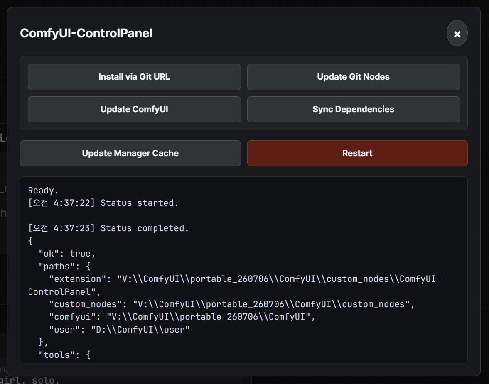

# ComfyUI-ControlPanel



ComfyUI-ControlPanel restores a few practical control panel workflows that are
not exposed in the modern ComfyUI Manager V4 UI unless the legacy UI is enabled.

The extension is packaged as a single ComfyUI custom node pack. Backend routes
live in `backend/`, the frontend extension lives in `frontend/`, and ComfyUI
loads the built frontend from `dist/index.js` through `WEB_DIRECTORY = "./dist"`.

This custom node pack is primarily maintained as a personal-use replacement for
[ComfyUI-Manager#3048](https://github.com/Comfy-Org/ComfyUI-Manager/pull/3048).

## Features

- Install a custom node directly from a Git URL.
- Update ComfyUI and Git-installed custom nodes without enabling the legacy Manager UI.
- Sync custom node dependencies through `comfy node uv-sync`.
- Replace the Manager repository cache with a safer and more efficient cache path.
- Update or rebuild the Manager cache when Replace Manager Repository Data is enabled.
- Save and restore Manager snapshots through the Comfy CLI.
- Open the `custom_nodes` and Manager snapshots folders from the panel on local installs.
- Show the parsed `comfy --json env` output in a table-style environment dialog.
- Restart ComfyUI from the control panel.
- Inspect the latest status JSON and clear the local operation log.

## Install

### From a GitHub Release

For normal use, install from the GitHub Release zip attached to a version tag,
not from GitHub's automatic source archive. The release zip includes the built
frontend file at `dist/index.js`, which ComfyUI needs at runtime.

For example, for `v1.1.0`, download the attached release asset named like:

```text
ComfyUI-ControlPanel-v1.1.0.zip
```

Extract the `ComfyUI-ControlPanel/` folder from the zip into:

```text
ComfyUI/custom_nodes/
```

Then restart ComfyUI.

### From Source

Install the development dependencies before building or testing from source:

```bash
pnpm install
uv sync --locked --group dev
```

For local ComfyUI usage, build the frontend once after installing dependencies:

```bash
pnpm build
```

## Security Model

ComfyUI-ControlPanel is local-first. ComfyUI does not provide a built-in user or
permission model for custom node HTTP routes, so the panel treats loopback access
as the default trust boundary.

By default, all `/control-panel/*` routes and the frontend panel UI are available
only to localhost clients such as `localhost`, `127.0.0.1`, and `::1`. This is
intentional because the panel can install Git repositories, update custom nodes,
restore snapshots, open local folders, and restart ComfyUI.

To allow remote clients on a trusted private deployment, set this in the
ControlPanel config file under the ComfyUI user directory:

```json
{
  "allow_remote_control": true
}
```

Do not enable remote control for ComfyUI instances exposed to untrusted networks.

## Development

```bash
pnpm dev
pnpm typecheck
pnpm test
pnpm test:unit
pnpm test:e2e
```

`pnpm test:e2e` builds the frontend, provisions a scoped ComfyUI install, and runs the Playwright smoke suite.

The backend is split by responsibility:

- `backend/manager_api.py` keeps the ComfyUI-facing compatibility facade.
- `backend/manager_routes.py` registers HTTP routes.
- `backend/manager_jobs.py` tracks background update jobs.
- `backend/manager_process.py` runs external commands and opens local folders.
- `backend/manager_cache.py` handles Manager and Comfy Registry cache data.
- `backend/manager_settings.py` reads and writes ControlPanel/Manager settings.
- `backend/manager_git.py` handles Git-based update flows.
- `backend/manager_cli.py` formats Comfy CLI responses.
- `backend/manager_runtime.py` handles runtime paths and restart helpers.

## Release

Publishing to the Comfy Registry is intentionally not automated. Releases are
GitHub Release zip artifacts built from version tags.

Create and push a version tag to publish an installable zip:

```bash
git tag v1.1.0
git push origin v1.1.0
```

The release workflow:

1. Checks out the tagged source.
2. Installs dependencies with Node.js 24, pnpm, and uv.
3. Runs typecheck and unit tests.
4. Builds the frontend.
5. Verifies that `dist/index.js` exists.
6. Uploads `ComfyUI-ControlPanel-vX.Y.Z.zip` to the GitHub Release.

### About `dist/index.js` in tag releases

`dist/` is intentionally ignored by Git, so GitHub's automatic source archives
for tags do not contain `dist/index.js`. Use the attached release zip instead;
it is created after `pnpm build` and includes the required `dist/index.js` file.

The separate `CI` workflow is manual-only and can be run when an extra validation
pass is useful before tagging.

### v1.1.0 notes

`v1.1.0` is expected to be released from a tag-built GitHub Release artifact.
Compared with the early `v1.0.0` shape, the control panel now includes Manager
cache rebuild/update actions, snapshot save/restore, local folder open actions,
Comfy CLI environment display, status JSON inspection, and a modularized backend
implementation.

## Docs

- [Testing](docs/TESTING.md)

## License

MIT because template was MIT.
