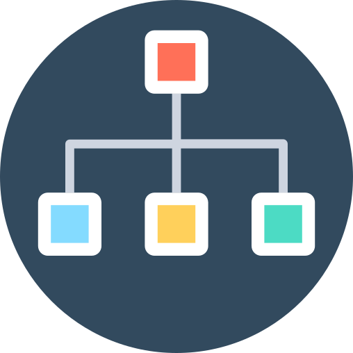

# ComfyUI-ControlPanel



ComfyUI-ControlPanel restores a few practical control panel workflows that are
not exposed in the modern ComfyUI Manager V4 UI unless the legacy UI is enabled.

The extension is packaged as a single ComfyUI custom node pack. Backend routes
live in `backend/`, the frontend extension lives in `frontend/`, and ComfyUI
loads the built frontend from `web/index.js` through `WEB_DIRECTORY = "./web"`.

This custom node pack is primarily maintained as a personal-use replacement for
[ComfyUI-Manager#3048](https://github.com/Comfy-Org/ComfyUI-Manager/pull/3048).

## Features


- Install a custom node directly from a Git URL.
- Update ComfyUI and Git-installed custom nodes without enabling the legacy Manager UI.
- Replace the Manager repository cache with a safer and more efficient cache path.
- Update or rebuild the Manager cache when Replace Manager Repository Data is enabled.
- Save and restore Manager snapshots through the Comfy CLI.
- Download a latest-version custom-node restore manifest and restore Registry/Git nodes from an uploaded JSON file.
- Open the `custom_nodes` and Manager snapshots folders from the panel on local installs.
- Show the parsed `comfy --json env` output in a table-style environment dialog.
- Restart ComfyUI from the control panel.
- Inspect the latest status JSON and clear the local operation log.
- Add missing `cnr_id`, `aux_id`, and version metadata when nodes are created or loaded.
- Repair Registry metadata across the active workflow, including nested subgraphs, with one Undo step.

### Node Manager


- Allow to use cache instead of off-cache fetch every time
- Effective and fast scroll between node view
- Manage Git nodes with fetch support

## Requirements

- [`comfy-cli`](https://docs.comfy.org/comfy-cli/getting-started), with the `comfy` command available on `PATH` (in `venv`).
- Git available on `PATH` for Git URL installation, updates, and restore manifests.
- ComfyUI-Manager enabled for Manager cache, snapshot, and Registry metadata features.

## Install

### From the Comfy Registry

Install the published package through ComfyUI Manager, or target the current
ComfyUI workspace with the Comfy CLI:

```bash
comfy node install comfyui-controlpanel
```

Restart ComfyUI after installation.

### From a GitHub Release

As a manual alternative, install from the GitHub Release zip attached to a
version tag, not from GitHub's automatic source archive. The release zip
includes the built frontend file at `web/index.js`, which ComfyUI needs at
runtime.

For example, for `v1.1.0`, download the attached release asset named like:

```text
ComfyUI-ControlPanel-v1.1.0.zip
```

Extract the `ComfyUI-ControlPanel/` folder from the zip into:

```text
ComfyUI/custom_nodes/
```

Then restart ComfyUI.

### From Source

Install the development dependencies before building or testing from source:

```bash
bun install
uv sync --locked --group dev
```

For local ComfyUI usage, build the frontend once after installing dependencies:

```bash
bun run build:custom-node
```

## Security Model

ComfyUI-ControlPanel is local-first. ComfyUI does not provide a built-in user or
permission model for custom node HTTP routes, so the panel treats loopback access
as the default trust boundary.

By default, all `/control-panel/*` routes and the frontend panel UI are available
only to localhost clients such as `localhost`, `127.0.0.1`, and `::1`. This is
intentional because the panel can install Git repositories, update custom nodes,
restore snapshots, open local folders, and restart ComfyUI.

When remote control is disabled, both the connection peer and HTTP `Host` must be
loopback. This prevents an external hostname routed through a local reverse proxy
or DNS rebinding from being treated as ordinary localhost access.

State-changing requests must also be same-origin. Requests without an `Origin`
header are accepted only from loopback clients so local command-line tools remain
usable. ControlPanel follows ComfyUI-Manager's operation policy: Git URL installs
require `allow_git_url_install = true` when Manager's `config.ini` is present,
middle-risk operations such as custom-node updates, snapshot restore, and restart
are blocked by `security_level = strong`, and ComfyUI updates remain low-risk
operations. When Manager's configuration is absent, ControlPanel remains usable
with its own access and same-origin checks rather than requiring Manager.

Commands that install or update code, restore state, or restart ComfyUI run only
after an explicit user action in the panel; loading a workflow does not execute
them. External commands are launched with argument arrays rather than shell
command strings. Custom nodes are installed without dependencies while ComfyUI
is running, and dependency reconciliation is delegated to `comfy node uv-sync`
after ComfyUI is closed. ComfyUI core updates and their requirements are
delegated to the official Comfy CLI updater.

To allow remote clients on a trusted private deployment, set this in the
ControlPanel config file under the ComfyUI user directory:

```json
{
  "allow_remote_control": true
}
```

Do not enable remote control for ComfyUI instances exposed to untrusted networks.
Enabling it deliberately transfers responsibility for authenticating and
protecting remote clients to the operator; browser requests must still be
same-origin and all Manager operation policies continue to apply.

## Development

See [DEV.md](./DEV.md) for setup, build, and deployment commands and [docs/TESTING.md](./docs/TESTING.md) for validation and manual checks.

## License

[MIT](./LICENSE), with [third-party notices](./THIRD_PARTY_NOTICES.md).
